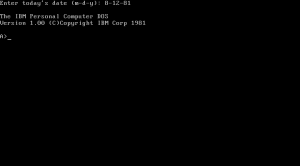

   

# MS-DOS v1.25 e v2.0 - Código fonte
Este repositório contém o código-fonte original e binários compilados para MS-DOS v1.25 e MS-DOS v2.0.

Estes são os mesmos arquivos [originalmente compartilhados no Computer History Museum em 25 de março de 2014]( http://www.computerhistory.org/atchm/microsoft-ms-dos-early-source-code/) e estão sendo (re ) publicado neste repositório para torná-los mais fáceis de encontrar, referência em escritos e trabalhos externos, e para permitir a exploração e experimentação para os interessados nos primeiros sistemas operacionais de PC.

# Licença
Todos os arquivos neste repositório são lançados sob a [Licença MIT (OSI)]( https://en.wikipedia.org/wiki/MIT_License) conforme o [arquivo LICENSE](https://github.com/Microsoft/MS -DOS/blob/master/LICENSE.md) armazenado na raiz deste repositório.

# Contribua!
Os arquivos de origem neste repositório são para referência histórica e serão mantidos estáticos, portanto, **não envie** solicitações de pull sugerindo quaisquer modificações nos arquivos de origem, mas sinta-se à vontade para bifurcar este repositório e experimentar 😊.

Se, no entanto, você quiser enviar conteúdo adicional não-fonte ou modificações em arquivos não-fonte (por exemplo, este README), envie via PR e analisaremos e consideraremos.

Este projeto adotou o [Código de Conduta de Código Aberto da Microsoft](https://opensource.microsoft.com/codeofconduct/). Para obter mais informações, consulte as [Perguntas frequentes sobre o código de conduta](https://opensource.microsoft.com/codeofconduct/faq/) ou entre em contato com [opencode@microsoft.com](mailto:opencode@microsoft.com) com quaisquer perguntas adicionais ou comentários.

# DOS 1.0 e 1.1
### A Revolução do PC

## O computador pessoal IBM
Em agosto de 1981, a IBM lançou seu Personal Computer (mais conhecido como PC) e o DOS 1.0. Era amplamente esperado que a Digital Research lançasse o CP/M-86 para o novo sistema (o que acabou acontecendo), mas, enquanto isso, havia o IBM Personal Computer DOS, afinal não muito diferente do CP/M. A IBM também anunciou o suporte UCSD p-System para o PC, mas apenas o DOS estava disponível no lançamento. O anúncio foi ansiosamente esperado e amplamente coberto pela imprensa .

Deve ser lembrado que com o primeiro IBM PC, o DOS era opcional. O PC veio com BASIC, que poderia atuar como um sistema operacional muito primitivo, embutido em sua ROM. O ROM BASIC poderia usar fita cassete como meio de armazenamento, embora esse método nunca tenha se tornado popular e as revisões posteriores do PC tenham removido completamente o suporte a cassetes.

O modelo de PC básico vinha com apenas 16 KB de RAM e sem drives de disco; a memória era expansível para 256 KB (bastante em 1981). O modelo equipado com uma unidade de disco veio com 64 KB de RAM, embora o próprio DOS precisasse de menos.

Deve-se notar que o DOS teoricamente seria capaz de rodar no modelo de PC básico com 16 KB de RAM. No entanto, isso não era uma opção na prática: o BIOS do PC carregava o setor de inicialização (de um disquete) no endereço 7C00h, que é 31KB, significando que não era possível inicializar o DOS em um PC com menos de 32KB de memória. Os aplicativos DOS naturalmente precisavam de memória adicional e podem ter requisitos de RAM do sistema significativamente maiores.

## Uma nota sobre os números de versão
A IBM foi inconsistente ao se referir aos números de versão do DOS. Por exemplo, ao inicializar o DOS, o usuário pode ver uma mensagem identificando o Personal Computer DOS como “Versão 3.00”. No entanto, a carta de anúncio da IBM para o mesmo produto se referia ao “DOS 3.0”. Essa inconsistência é refletida no texto a seguir; referências a, por exemplo, DOS 2.10 e DOS 2.1 são equivalentes.

## DOS 1.0
A primeira versão do DOS era quase mais interessante pelo que não podia fazer do que pelo pouco que podia. O DOS 1.0 podia ler e gravar disquetes de 160 KB, iniciar aplicativos .COM e .EXE e processar arquivos em lote (.BAT). Ele poderia manter o controle de data e hora (de forma alguma um recurso onipresente na época), embora ambos tivessem que ser inseridos manualmente toda vez que o DOS fosse iniciado. Um arquivo de lote chamado AUTOEXEC.BAT pode ser executado automaticamente na inicialização.

